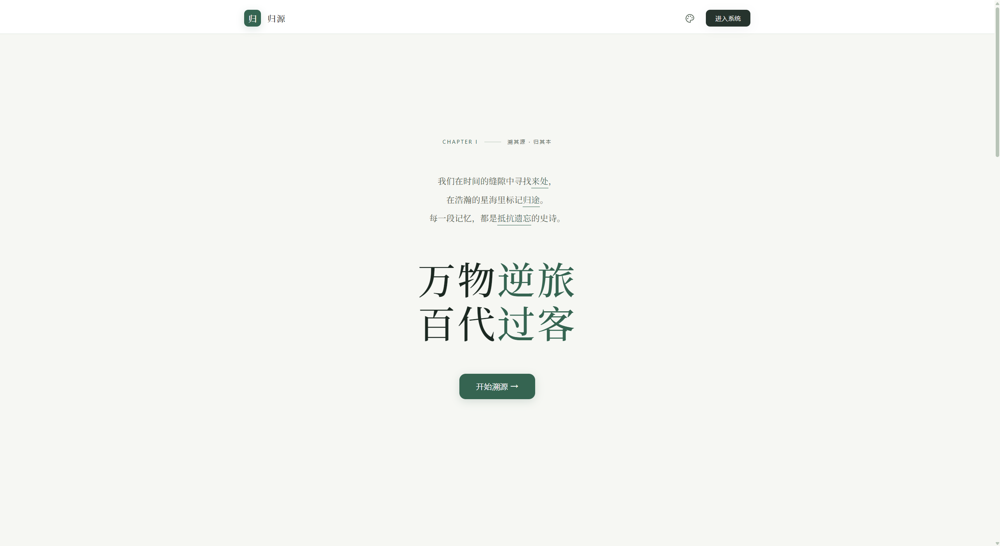
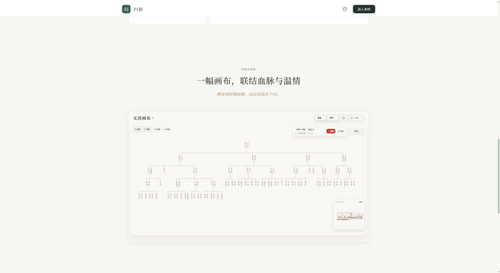
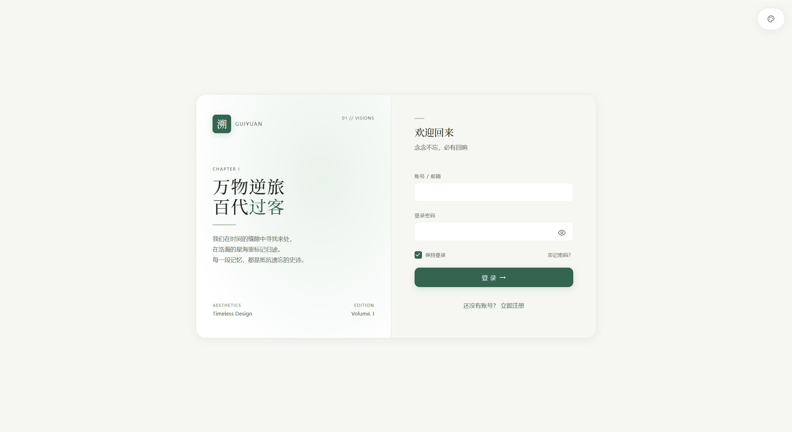
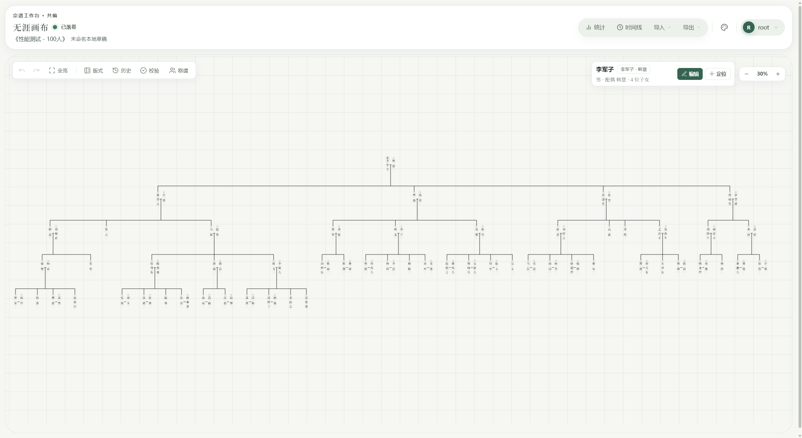

# 归源 · 数字化族谱编修与古籍出版系统

归源是一套面向家族谱牒整理、协作修订与传统线装出版的现代化数字化工具。深度融合中国传统文脉美学与现代图形学技术，覆盖 Web 端无限画布族谱工作台、古籍出版排版工坊、宗族洞察大屏、家族全景编年史以及 Docker 一键容器化部署方案。









## 功能概览

### 1. 宗谱工作台（无限画布）

- **无限画布世系树**：支持自由拖拽、平滑缩放（Fly-to Camera）、微缩地图（Minimap）鹰眼导航与大规模家族节点排布。
- **人物资料全维档案**：姓名、生卒纪年、配偶、排行、字辈、堂号、传记历程与照片集中管理。
- **中国传统亲属称谓计算器**：基于世系图谱拓扑关系，实时推算任意两位族人之间的九族称谓。
- **分支挂载与合并**：主谱支持外接挂载分支族谱，并支持定向子树合并。
- **多版本冲突保护**：基于 JPA `@Version` 乐观锁机制与前端草稿持久化，保障多人协作不被互相覆盖。
- **撤销/重做与历史抽屉**：完整记录节点的增删改动，支持真实时间线节点连线与一键回溯。

### 2. 传统古籍出版工坊

- **谱书书稿自动生成**：从当前世系树自动推导始祖至各代裔孙，生成可编辑、可翻页的古籍书稿。
- **九寸开本仿古版式**：大题签、天头地脚、鱼尾版心、象牙边栏、字辈排版与跨页续排支持。
- **矢量 PDF 印刷级导出**：客户端基于 `pdf-lib` 与 `@pdf-lib/fontkit` 生成高精度矢量文字与边框线条。
- **字体与字符级字形回退**：内置多款传统书法字体与宣纸材质，独创逐字符字形回退算法，彻底消除生僻字缺字方框。
- **版式设计抽屉**：支持可视化调整栏位、边距、字体字号与鱼尾样式，所见即所得实时排版。

### 3. 东方传统 5 大雅致主题体系

全站各界面（工作台、古籍工坊、大屏、详情页、登录页等）支持一键无缝切换并自动持久化：
- **经典 · 宣纸**：温润宣纸米黄底 + 传统朱砂赤（文卷朱批，古籍沉香）
- **素白 · 黛蓝**：清晰冷灰白底 + 案牍黛蓝色（档案考据，严谨沉稳）
- **纸白 · 徽墨**：现代极简纯白底 + 沉凝古法徽墨（白纸黑字，水墨留白）
- **宣白 · 松绿**：柔和浅宣白底 + 松林幽翠绿（本固枝荣，生生不息）
- **玄墨 · 霁蓝**：玄墨深黑漆底 + 星夜霁蓝幽光（夜读星象，清澈护眼）

### 4. 家族全景编年史与宗族洞察数据大屏

- **全景编年史**：整合中国朝代干支纪年对照（宋元明清民国现代）、先祖生卒历程长河图、宗族重大历史事件。
- **宗族洞察数据大屏**：世代人口金字塔、昭穆字辈用字频率词云、男女比例与存殁人口演进统计。

### 5. 智能校验规则引擎

- 内置语义级智能校验规则（`GEN_001` ~ `GEN_010`）：
  - 父母-子女年龄跨度合理性分析
  - 子女出生年份顺序校验
  - 世代与字辈一致性检查
  - 潜在重复人物与同名冲突预警
  - 断代孤岛与未挂载分支检测

### 6. 数据交换与安全协作

- **GEDCOM 5.5 兼容**：支持导入与导出国际标准 GEDCOM 族谱文件。
- **自包含独立 HTML 导出**：可导出单个完全不依赖外部服务器、脱机双击即开的交互式族谱网页，支持设置密码保护。
- **高清海报与矢量导出**：支持导出用于大幅面印刷的 SVG、PNG 与落款海报。
- **权限与隐私脱敏**：支持系统级 RBAC（OWNER / EDITOR / VIEWER），针对外部分享链接提供在世人物敏感信息隐藏。

---

## 技术栈

| 模块 | 核心技术 |
| :--- | :--- |
| **前端** | Vue 3, Vite 6, TypeScript, Pinia, Vue Router, Canvas 2D, pdf-lib, @pdf-lib/fontkit |
| **后端** | Java 17, Spring Boot 3.3, Spring Security, Spring Data JPA, Flyway |
| **数据库** | MySQL 8, H2 (单元与集成测试) |
| **测试框架** | Vitest, Vue Test Utils, Playwright, JUnit 5, Spring Security Test |
| **工程规范** | ESLint, Biome, vue-tsc |
| **容器部署** | Docker, Docker Compose, Nginx 反向代理 |

---

## 环境要求

- **Java**：17+
- **Node.js**：18+
- **MySQL**：8+
- **Docker & Docker Compose**（可选，生产部署时需要）

---

## 本地开发指南

### 1. 初始化数据库

```sql
CREATE DATABASE genealogy CHARACTER SET utf8mb4 COLLATE utf8mb4_unicode_ci;
```

### 2. 配置后端环境变量

```bash
cd backend
cp .env.example .env.local
```

编辑 `backend/.env.local`，确认本地配置：

```text
DB_URL=jdbc:mysql://localhost:3306/genealogy?useUnicode=true&characterEncoding=UTF-8&useSSL=false&allowPublicKeyRetrieval=true&serverTimezone=Asia/Shanghai
DB_USERNAME=root
DB_PASSWORD=your_mysql_password
JWT_SECRET=replace-with-local-development-secret
APP_CORS_ALLOWED_ORIGINS=http://localhost:5173
```

> 后端启动时会自动读取 `backend/.env.local`。首次启动时，Flyway 会自动执行数据库迁移脚本初始化表结构。

### 3. 启动后端

```bash
cd backend
./mvnw spring-boot:run
```

Windows PowerShell：

```powershell
cd backend
.\mvnw.cmd spring-boot:run
```

后端服务默认运行在 `http://localhost:8080`。

### 4. 启动前端

```bash
cd frontend
npm install
npm run dev
```

浏览器访问 `http://localhost:5173`。

默认管理员登录凭证：
- 用户名：`root`
- 密码：`123456`

*(首次登录后请在个人设置中修改密码)*

### 5. 导入示例族谱

系统内置了两份现成的标准族谱压测数据集：
- [`samples/performance-test-100-persons.json`](samples/performance-test-100-persons.json)（100 人，快速体验）
- [`samples/performance-test-500-persons.json`](samples/performance-test-500-persons.json)（500 人，规模性能测试）

登录系统后，在工作台或列表页点击“导入数据”并选择对应的 JSON 文件即可一键载入。

---

## 常用开发命令

### 前端开发与质量验证

```bash
cd frontend
npm run dev          # 启动本地开发服务
npm run build        # 生产打包
npm run test         # 运行 Vitest 单元测试
npm run test:e2e     # 运行 Playwright 端到端测试
npm run lint         # ESLint 代码检查
npm run biome:check  # Biome 快速代码诊断
```

### 后端测试与构建

```bash
cd backend
./mvnw test               # 运行后端单元与集成测试
./mvnw clean package      # 打包生成 jar 产物
```

---

## Docker 生产部署

生产部署配置文件位于 [`release/`](release/)：

1. 准备环境变量：
   ```bash
   cp release/.env.example release/.env
   ```
   编辑 `release/.env`，设置强口令（`MYSQL_ROOT_PASSWORD`、`MYSQL_PASSWORD`、`JWT_SECRET` 等）。

2. 一键构建并启动服务：
   ```bash
   docker compose --env-file release/.env -f release/docker-compose.yml up --build -d
   ```

3. 检查容器运行状态：
   ```bash
   docker compose --env-file release/.env -f release/docker-compose.yml ps
   ```

4. 停止服务：
   ```bash
   docker compose --env-file release/.env -f release/docker-compose.yml down
   ```

> 生产服务器还可直接执行根目录的 [`update.ps1`](update.ps1) 脚本，自动拉取最新主分支代码并平滑热更新重启容器。

---

## 项目工程结构

```text
guiyuan/
├── backend/                    # Spring Boot 3 后端服务
│   ├── src/main/java/          # API 控制器、业务服务、领域实体、权限控制与智能校验
│   ├── src/main/resources/     # 配置文件与 Flyway 数据库迁移脚本
│   └── src/test/java/          # 单元测试与集成测试
├── frontend/                   # Vue 3 Web 前端应用
│   ├── src/api/                # REST API 客户端
│   ├── src/components/         # 基础组件、工作台、古籍排版工坊等 UI 组件
│   ├── src/composables/        # 组合式业务逻辑与状态函数
│   ├── src/features/           # 导出分享、古籍排版、历史追溯、版本冲突、智能校验
│   ├── src/lib/                # 世系树布局算法、亲属计算器、排版排版引擎
│   ├── src/router/             # 路由配置与鉴权拦截
│   ├── src/stores/             # Pinia 状态仓库 (主题管理、词典系统等)
│   ├── src/styles/             # Yohaku 美学设计系统与 Design Tokens
│   ├── src/views/              # 页面视图 (工作台、编年史、大屏、管理端等)
│   ├── e2e/                    # Playwright 端到端自动化测试
│   └── public/vrain/           # 古籍字体、宣纸纹理与排版矢量资源
├── release/                    # Docker 生产容器部署配置 (Compose / Nginx / Dockerfile)
├── samples/                    # 示例族谱压测数据集 (100人 / 500人)
├── screenshots/                # 产品核心界面展示截图
├── AGENTS.md                   # 智能体指令与项目指南
├── CLAUDE.md                   # Claude 规范配置
├── LICENSE                     # AGPL v3 开源协议
├── README.md                   # 项目核心说明文档
├── update.ps1                  # 生产一键拉取与热更新部署脚本
├── .dockerignore               # Docker 忽略文件
└── .gitignore                  # Git 忽略文件
```

---

## 安全与运维提示

- **密钥隔离**：切勿将 `.env.local`、`release/.env` 或包含真实私钥的文件提交至代码仓库。
- **默认凭证**：默认管理员密码（`root` / `123456`）仅用于初次启动，进入生产环境后必须第一时间修改。
- **数据卷安全**：执行 `docker compose down -v` 会彻底清除数据库持久化卷，生产环境谨慎使用 `-v` 参数。

---

## 开源协议

本项目采用 **GNU Affero General Public License v3 (AGPL v3)** 协议开源。

- 个人学习、研究与非商用修改：允许自由使用。
- 自行部署与内部使用：允许。
- 基于本项目提供网络服务的二次分发：须遵循 AGPL v3 规定开源对应修改。
- 商业授权需求请联系作者。

详见 [LICENSE](LICENSE)。
