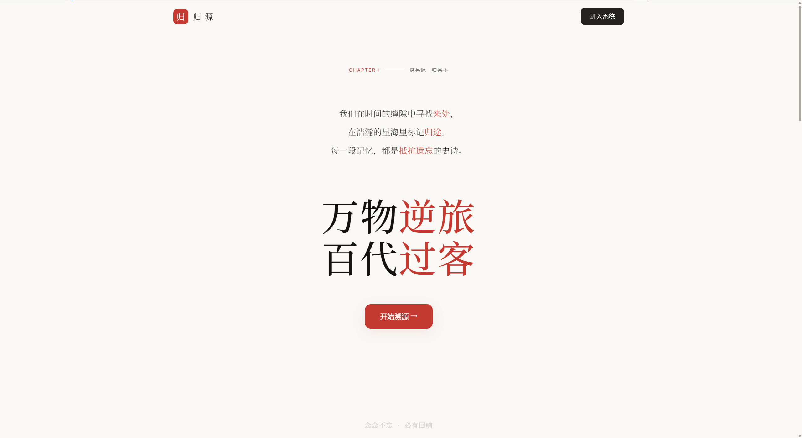
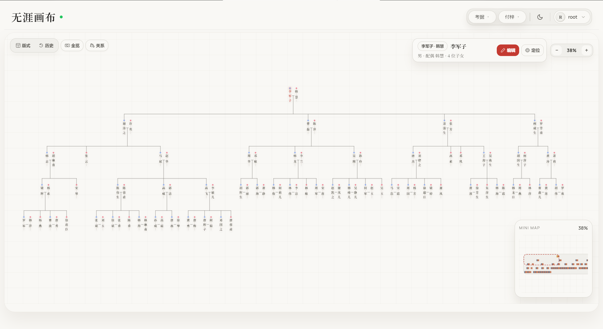
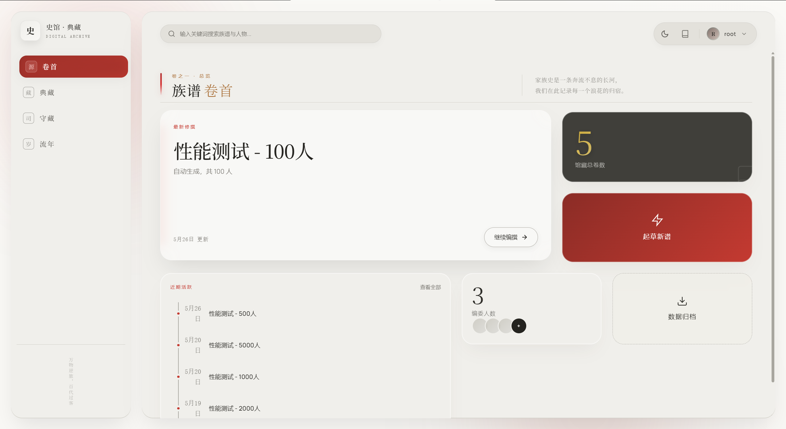
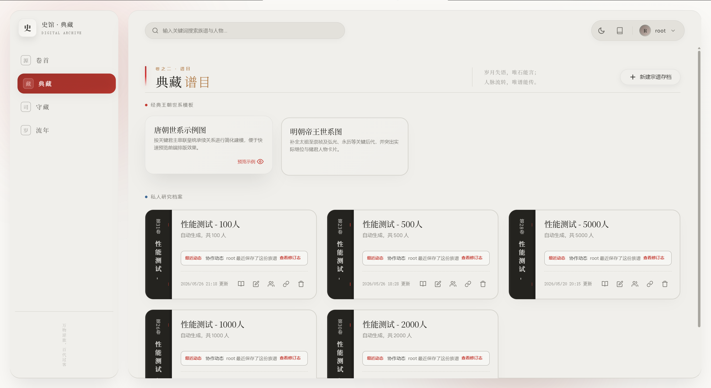

# 归源 · 族谱管理系统

归源是一套面向家族族谱整理、协作修订与传统出版的数字化工具。它同时覆盖 Web 端族谱工作台、出版工作室、后台管理、小程序入口和 Docker 部署方案，适合从个人家谱整理扩展到多人协作、审稿、分享与印刷排版。









## 功能概览

### 族谱编辑

- 无限画布族谱树：支持拖拽、缩放、平移和大规模人物节点编辑。
- 人物资料维护：姓名、生卒、配偶、子女、传记、照片等信息集中管理。
- 亲属关系计算：根据树结构实时推算任意两人的称谓关系。
- 分支挂载与合并：主谱可挂载分支族谱，并选择子树合并。
- 冲突处理：使用版本号和乐观锁避免多人编辑时互相覆盖。

### 协作与权限

- 账号与角色：支持管理员、族谱所有者、编辑者、查看者等访问边界。
- 字段级隐私：可对查看者隐藏或脱敏生卒年、生平笔记、照片等信息。
- 审核流程：族人账号和变更申请可进入后台审核。
- 操作审计：保留关键操作记录，便于追踪协作过程。

### 导入、导出与分享

- JSON 导入/导出：用于备份、迁移和离线交换族谱数据。
- GEDCOM 导入/导出：兼容通用家谱数据交换格式。
- 自包含 HTML 分享：导出可独立打开的交互式族谱页面，支持密码保护。
- SVG/图片导出：便于进一步排版、印刷和外部设计加工。

### 出版工作室

- 古籍书稿编辑器：从当前族谱自动生成可编辑、可保存的谱书文档。
- 世系录排版：按当前宗支入口分析世代，将人物资料转换为传统谱书条目。
- 仿古书版预览：支持版框、竖排文字、栏线和古籍风格模板。
- 客户端 PDF 导出：使用 pdf-lib 与嵌入中文字体生成矢量文字和线条。
- 传记编辑：为人物条目维护更完整的生平内容。
- 内置字体与纹理：提供多款中文字体和古籍风格背景资源。

### 数据分析与体验

- 族谱统计：世代分布、寿命统计、性别比例等基础分析。
- 时间线：展示家族大事和人物生平节点。
- 全局搜索：支持人物、族谱标题等快速检索。
- 双主题界面：浅色和暗色主题，基于设计令牌统一维护。
- 小程序入口：`miniapp/` 提供 uni-app 微信小程序与 H5 基础工程。

## 技术栈

| 模块 | 技术 |
| --- | --- |
| 前端 | Vue 3, Vite 6, TypeScript, Pinia, Vue Router, Canvas 2D, pdf-lib, @pdf-lib/fontkit |
| 后端 | Java 17, Spring Boot 3.3, Spring Security, Spring Data JPA, Flyway |
| 数据库 | MySQL 8, H2 测试数据库 |
| 小程序 | uni-app, Vue 3, Pinia, Vite |
| 测试 | Vitest, Vue Test Utils, Playwright, JUnit, Spring Security Test |
| 质量检查 | ESLint, Biome, vue-tsc |
| 部署 | Docker, Docker Compose, Nginx |

## 环境要求

- Java 17+
- Node.js 18+
- MySQL 8+
- Docker 与 Docker Compose（可选，仅部署时需要）

## 本地开发

### 1. 创建数据库

```sql
CREATE DATABASE genealogy CHARACTER SET utf8mb4 COLLATE utf8mb4_unicode_ci;
```

### 2. 配置后端环境变量

```bash
cd backend
cp .env.example .env.local
```

编辑 `backend/.env.local`，至少确认以下变量：

```text
DB_URL=jdbc:mysql://localhost:3306/genealogy?useUnicode=true&characterEncoding=UTF-8&useSSL=false&allowPublicKeyRetrieval=true&serverTimezone=Asia/Shanghai
DB_USERNAME=root
DB_PASSWORD=your_mysql_password
JWT_SECRET=replace-with-local-development-secret
APP_CORS_ALLOWED_ORIGINS=http://localhost:5173
```

> 后端配置会从环境变量读取数据库和 JWT 设置。生产环境必须设置足够强的 `JWT_SECRET`。

### 3. 启动后端

```bash
cd backend
./mvnw spring-boot:run
```

Windows PowerShell 可使用：

```powershell
cd backend
.\mvnw.cmd spring-boot:run
```

后端默认运行在 `http://localhost:8080`。首次启动时，Flyway 会自动执行 `backend/src/main/resources/db/migration/` 下的迁移脚本。

### 4. 启动前端

```bash
cd frontend
npm install
npm run dev
```

浏览器打开 `http://localhost:5173`。

默认管理员账号：

| 用户名 | 密码 |
| --- | --- |
| `root` | `123456` |

首次登录后建议立即修改默认密码。

### 5. 导入示例数据

仓库内置两份示例族谱数据：

| 文件 | 人数 | 用途 |
| --- | --- | --- |
| [`samples/performance-test-100-persons.json`](samples/performance-test-100-persons.json) | 100 人 | 快速体验 |
| [`samples/performance-test-500-persons.json`](samples/performance-test-500-persons.json) | 500 人 | 性能测试 |

进入 Dashboard 后，点击导入族谱数据并选择 JSON 文件即可。

## 常用命令

### 前端

```bash
cd frontend
npm run dev
npm run build
npm run test
npm run lint
npm run biome:check
npm run test:e2e
```

### 后端

```bash
cd backend
./mvnw test
./mvnw spring-boot:run
```

### 小程序

```bash
cd miniapp
npm install
npm run dev:mp-weixin
npm run build:mp-weixin
npm run dev:h5
npm run build:h5
```

## Docker 部署

Docker Compose 部署配置位于 [`release/`](release/)，包含 MySQL、后端和前端服务。

```bash
cp release/.env.example release/.env
```

编辑 `release/.env`，至少修改：

- `MYSQL_ROOT_PASSWORD`
- `MYSQL_PASSWORD`
- `JWT_SECRET`
- `APP_CORS_ALLOWED_ORIGINS`

源码构建部署：

```bash
docker compose --env-file release/.env -f release/docker-compose.yml up --build -d
```

查看状态：

```bash
docker compose --env-file release/.env -f release/docker-compose.yml ps
```

停止服务：

```bash
docker compose --env-file release/.env -f release/docker-compose.yml down
```

更多镜像部署和数据卷说明见 [`release/README.md`](release/README.md)。

## 测试覆盖入口

当前仓库按模块组织测试：

- 前端单元测试：`frontend/src/**/*.test.ts`
- 前端 E2E 测试：`frontend/e2e/specs/*.spec.ts`
- 后端测试：`backend/src/test/java/**/*Test.java`
- 后端集成测试：`backend/src/test/java/com/genealogy/server/integration/`

提交前建议至少运行：

```bash
cd frontend && npm run test && npm run build
cd backend && ./mvnw test
```

## 项目结构

```text
.
├── backend/                    # Spring Boot 后端
│   ├── src/main/java/          # 控制器、服务、实体、仓储、安全与校验逻辑
│   ├── src/main/resources/     # 应用配置与 Flyway 迁移
│   └── src/test/java/          # 后端单元与集成测试
├── frontend/                   # Vue 3 Web 前端
│   ├── src/api/                # API 客户端
│   ├── src/components/         # 通用组件与工作台组件
│   ├── src/composables/        # 状态与交互逻辑
│   ├── src/features/           # 导入导出、古籍书稿、历史、冲突、校验、管理等功能模块
│   ├── src/lib/                # 族谱布局、亲属关系、出版排版引擎
│   ├── src/router/             # 路由与鉴权守卫
│   ├── src/views/              # 页面视图
│   ├── e2e/                    # Playwright 测试
│   └── public/vrain/           # 出版字体、纹理与图片资源
├── miniapp/                    # uni-app 小程序与 H5 工程
├── release/                    # Docker Compose 部署配置
├── samples/                    # 示例族谱数据
├── screenshots/                # README 截图
├── config/                     # 项目辅助配置
├── docs/                       # 项目文档
├── LICENSE                     # AGPL v3
└── README.md
```

## 配置与安全提示

- 不要提交 `.env.local`、`release/.env` 或任何真实密钥。
- 生产环境必须设置强 `JWT_SECRET`，并根据域名调整 `APP_CORS_ALLOWED_ORIGINS`。
- 使用 HTTPS 时应同步开启安全 Cookie 配置。
- 默认管理员密码仅用于本地初始化，正式部署后应立即修改。
- 执行破坏性 Docker 命令前确认数据卷备份，`docker compose down -v` 会删除数据库卷。

## 开源协议

本项目采用 **GNU Affero General Public License v3 (AGPL v3)**。

- 个人使用、学习、修改：允许。
- 自行部署使用：允许。
- 将修改后的代码作为网络服务提供：需要按 AGPL v3 开源对应修改。
- 闭源商业使用：请联系作者获取商业授权。

详见 [LICENSE](LICENSE)。
